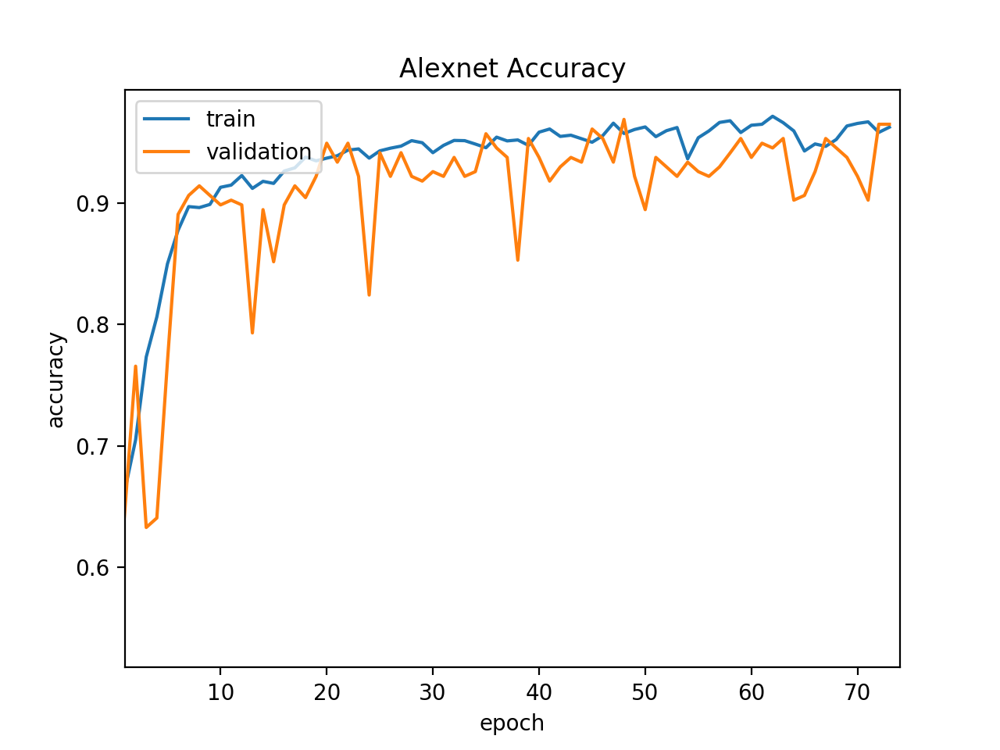
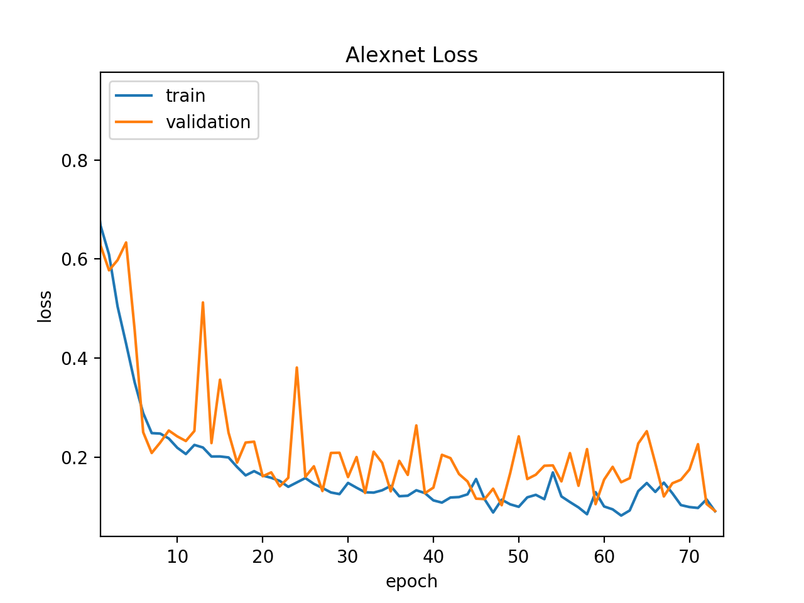
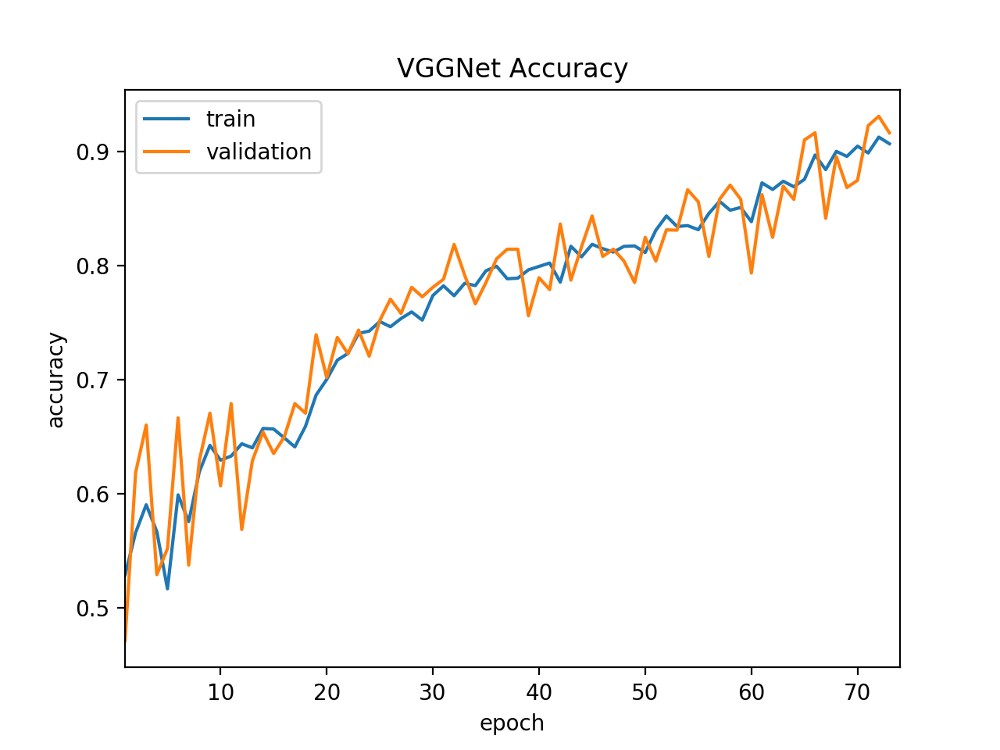
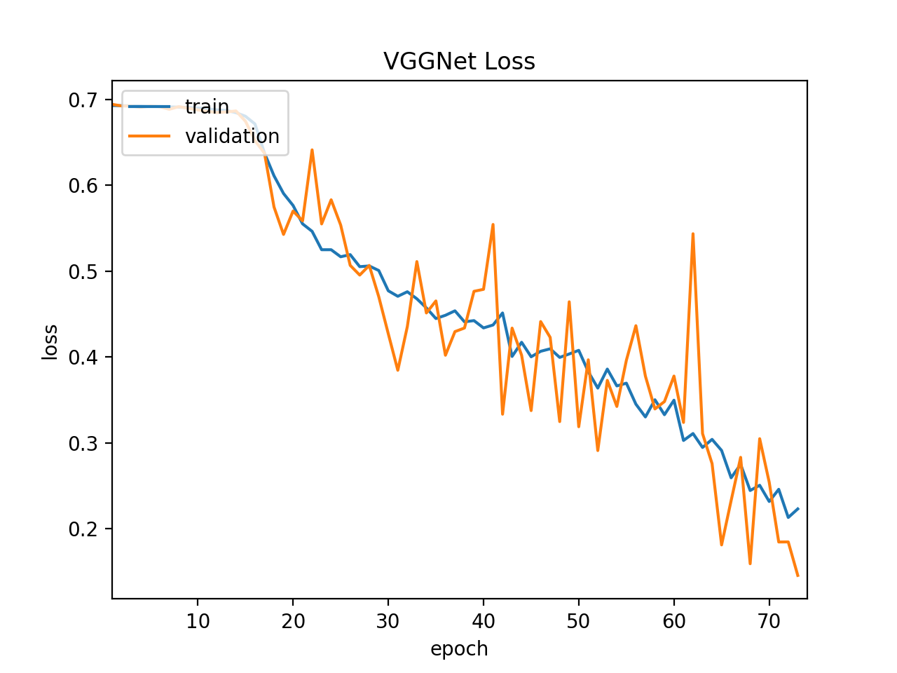

# Classifying gender using various machine learning models
Machine Learning term project by Jonathan Bazan, Joshua Kasanjian, Sadiq Sarwar

## Data
We obtained our data from this Kaggle Project:   
https://www.kaggle.com/bmarcos/image-recognition-gender-detection-inceptionv3/data   
The dataset contains 202,599 images of the faces of many celeberties, along with a CSV file with 40 binary
attributes per image, one of them being "Male" that tells us the gender. We aimed to classify the gender of an image using
the raw image data with Convolutional Neural Networks (CNNs), as well as using the extracted features alone, and compare the results.  
   
To accomplish this, we divided the dataset into 20,000 training, 5,000 validation, and 5,000 test samples, ensuring that 
each set is class balanced.

## AlexNet
AlexNet is a well-known CNN architecture that uses 5 convolution layers and 3 fully connected layers. We constructed and trained
an AlexNet model for 75 epochs with a batch size of 256.
#### Results
Accuracy

Loss

## VGGNet
VGGNet-16 is another well-known CNN architecture that uses 13 convolution layers and 3 fully connected layers. We constructed and trained
an AlexNet model for 74 epochs with a batch size of 96.
#### Results
Accuracy

Loss

## Logistic Regression
We used the 40 binary features of each image to train a Logistic Regression classifier. To obtain the 
label of each data point, we extracted the "Male" features. The remaining 39 features were used to 
predict the label of each data entry. We compared using Gradient Descent and Stochastic Gradient Descent (SGD) 
to update the weights. Moreover, we trained the model with varying numbers of iterations (100, 500, 1000, 5000) 
and varying learning rates (0.1, 0.2, 0.5).   
   
#### Results
Using Gradient Descent: 
Train Accuracy: 0.9380142857
Test Accuracy: 0.9382571429   
   
Using SGD: 
Train Accuracy: 0.7939642857
Test Accuracy: 0.7903928571   
